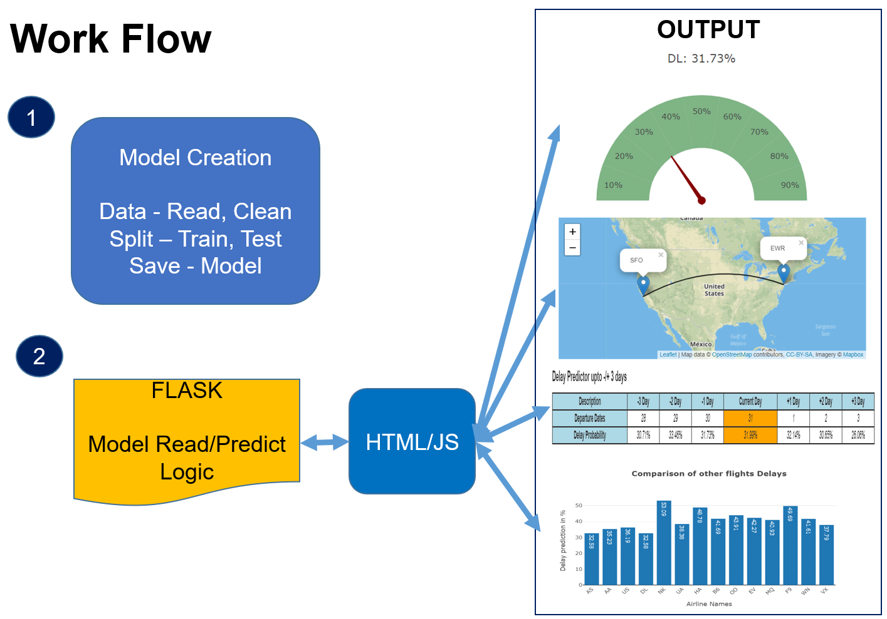

# Airline Arrival Delay Prediction

### Author

Bharat, Gokul and Ritesh @UCB @2019

## Introduction

The Airline-Delay Predictor App gives you the ability to predict the probability of arrival delay to your destination. 
The probability of finding the delay prediction is based on one whole year flight statistics from “LINK” and using the Logistic Regression Model.
We used python flask app to create an app where user selects the desired route (Origin and Destination airports), airline, date of travel and departure time.
Our model predicts the arrival delay % and also gives the user the delay prediction for +/- 3 days from the entered date and for that same date the delay prediction in percentage of other airlines if travelled on the same date and time.

## Approach summary

The dataset is cleaned using Pandas and imported to CSV, JSON files and converted into a dashboard showing different visualizations and data using HTML, CSS, and JavaScript.

## Arrival Delay Prediction
Our App enables you to find the flight that’s most likely get delayed. To do this, the user selects origin airport, destination airport, airline, date and departure hour of travel. Using historical data, we use machine learning (Logistic Regression Model) to predict the % of the flight getting delayed to arrival destination. 

## Model Creation
### Data cleaning Process
* Read the data source [Airlines data](http://datasets.flowingdata.com/tuts/maparcs/flights.csv)
* [Data_Cleaning.ipynb](https://github.com/bbchopra/project3_airline_delay_prediction_app/blob/master/Data_Cleaning.ipynb) to perform all ETL.
* **Extraction**
  * Read the CSV and load into a pandas DataFrame.
  * The data points used is above 5 million
  * The data points distribution for on arrival vs delayed flights is as below (image of data distribution):
  * Read the CSV and load into a pandas DataFrame.

* **Transform**
  * Copy only the columns needed into a new DataFrame.
  * Create dummy columns for input values
  
* **Model Training and Testing**
  * Split the data for train and test purpose
  * Fit the model using the train data
  * Predict the output with test data
  * Calculate the accuracy of the model
* **Model Testing with user data**
  * Create same format of input as train and test data for 1 input 
  * Load the model and use this user input to get the prediction of delay in percentage

* **Built With**
  * Python
  * Pandas
  * Flask
  * Scikit-learn (LogisticRegression)
  * Scikit-learn (LogisticRegression)
  * HTML, CSS, Bootstrap CSS, Javascript

## Description of Files in Github repository
Detailed description on how the project was built:

- Main Data Sources
	- [Airlines data](http://datasets.flowingdata.com/tuts/maparcs/flights.csv)
	- [Airport details](https://gist.github.com/tdreyno/4278655#file-airports-json) - containing the coordinates of major Airports in the USA.
    - [flights_Year_Data.csv] Downloaded from Kaggle. The file size of this file is 500+MB, not able to upload to GitHub. Download “flights.csv” from “https://www.kaggle.com/usdot/flight-delays#flights.csv” and rename it to “flights_Year_Data.csv” in local

- Back-end
    - [airline.py](https://github.com/bbchopra/project3_airline_delay_prediction_app/blob/master/airline.py) Flask, get user input, load model, predict the arrival delay percentage
		- @app.route(‘/’) for Main Index File
		- @app.route("/analytics") for real time visuals and predictions for the predicted
    - [Data_Cleaning.ipynb](https://github.com/bbchopra/project3_airline_delay_prediction_app/blob/master/Data_Cleaning.ipynb) - Clean and prepare the dataset
    - [ML_logistic.ipynb](https://github.com/bbchopra/project3_airline_delay_prediction_app/blob/master/ML%20-%20logistic.ipynb) – Create, train, test, save Logistic regression model
    - [Delay_Predict.ipynb](https://github.com/bbchopra/project3_airline_delay_prediction_app/blob/master/Delay_Predict.ipynb) – Test user input
    
- Front-end
    - templates/[home.html](https://github.com/bbchopra/project3_airline_delay_prediction_app/blob/master/templates/home.html) is the landing page of the Application and allos the User to select the Airlines and other details to predict the delay % and compare with other airlines upon submission
    - static/js/[analytics.html](https://github.com/bbchopra/project3_airline_delay_prediction_app/blob/master/templates/analytics.html) is the final page that shows all the predictions, comparisons
    - static/js/[gauge.js](https://github.com/bbchopra/project3_airline_delay_prediction_app/blob/master/static/js/gauge.js) - plot arrival delay percentage in gauge form
    - static/js/[analytics.js](https://github.com/bbchopra/project3_airline_delay_prediction_app/blob/master/static/js/analytics.js) - plot the route map using the longitude and latitude coordinates of the airports selected
    - static/js/[barchart.js](https://github.com/bbchopra/project3_airline_delay_prediction_app/blob/master/static/js/barchart.js) - plot the bar chart comparison of arrival prediction delay for all the Airlines
    - static/js/[table.js](https://github.com/bbchopra/project3_airline_delay_prediction_app/blob/master/static/js/table.js) plot the +/- 3 days arrival delay prediction for the user input airline
    - static/css/[style.css](https://github.com/bbchopra/project3_airline_delay_prediction_app/blob/master/static/css/style.css) and static/css/[css.css](https://github.com/bbchopra/project3_airline_delay_prediction_app/blob/master/static/css/css.css) contains formatting specifications
	- [leaflet.curve.js](https://elfalem.github.io/Leaflet.curve/src/leaflet.curve.js) is a new java script which has been used to draw a curved path/line between two sets of coordinates
    - static/js/`config.js` contains the API key for mapbox

## Output and Analysis

* **Visualizations**
* Landing Page:
The landing page of the application. This allows the user to select Origin, Destination Airports, desired Carrier, desired date of travel, time window and submit the selection

* Guage Chart:
A Gauge meter which indicates the arrival delay percentage in gauge form
* Route Map:
Shows the route map using a curved path between the source and destination airport codes. Allows the User to Zoom into the map.

* Table:
A tabular representation of the delay percentage for the selected Airline with arrival delay prediction upto -/+ 3 days highlighting the selected data in Orange color.
* Bar Chart:
Bar chart comparison of arrival prediction delay for all airlines.
